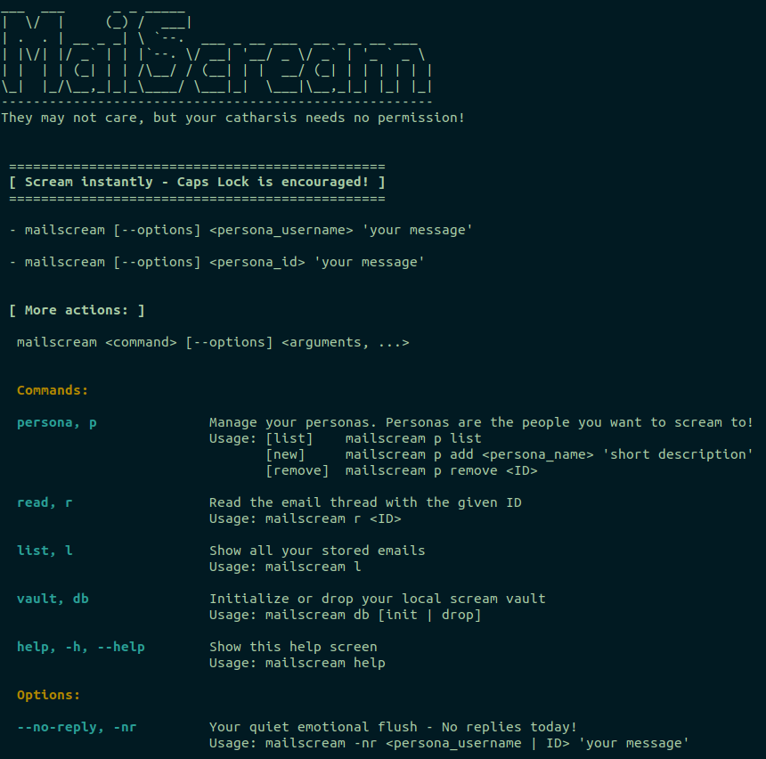

# MailScream™

_Because, sometimes, it's the only way!!_

### Ever drafted or wanted to send a rage email at 2AM... and had the wisdom not to send it?

Yeah. Us too.

**MailScream™** is your offline scream vault — a local-first CLI app for venting into the void (with sarcasm plugins, if you're brave).

* Compose that spicy email.

* Send it.. Yes, SEND it - into the void.

* Get roasted by your imaginary boss if you enable OpenAI (or OpenAI compatible LLM).

* Repeat as necessary.

**No** servers. **No** surveillance. Just screaming and rolling into the void.

Because burnout is real, and revenge emails are best left unsent.

MailScream™ is Not just for catharsis, but for encouraging healthy emotional boundaries! 🎭✨


## Testimonials

> "MailScream saved my job. Or at least my keyboard." — anonymous developer, post-standup meltdown

## CLI Menu Commands




## Install Dependencies:

```shell
# Update system
sudo apt update && sudo apt upgrade

# Install build tools and libraries
sudo apt install build-essential git
sudo apt install libcurl4-openssl-dev
sudo apt install libsqlite3-dev
sudo apt install libmicrohttpd-dev
sudo apt install libjson-c-dev
sudo apt install cmake

```

## Download, Compile and Run

> ⚠️ Shells like `bash` and `zsh` interpret `!!` as a special command. 
> Try to always wrap your messages in single quotes to avoid weird behaviors.

```shell
# Clone/copy your code
git clone git@github.com:mr-ragman/mailscream.git
cd mailscream

# Run make
make clean 2>/dev/null || echo "Nothing to clean"

# Quick dev:debug
make

# [optional] - view the linkage
# ldd mailscream

# OR Compile manually
# gcc -D_POSIX_C_SOURCE=200809L -g -Wall -Wextra -O2 -Wpedantic -std=c11 -O2 -fstack-protector-strong -DNDEBUG src/main.c src/utils/helper.c src/vault/vault.c src/commands/scream.c src/commands/persona.c -o mailscream-prod -lsqlite3

# (OPTIONAL) Set environment variables for maximum sarcasm!
# export LLM_API_KEY="sk-123xyz"
# export LLM_COMPLETION_URL="https://api.openai.com/v1/completions"

# Main menu
./mailscream

# Finally, create your local vault (db) to store your rants!
./mailscream db init

# Your first persona
./mailscream p add Karen99 'The wanna be boss because she has been here for over 4 years!'

# Your first scream
./mailscream Karen99 'If I hear your voice one more time.. i am going to burn this place up!!'

# View your persona list
./mailscream p list

# view your messages
./mailscream list

# read a particular thread/message (by ID)
./mailscream r 1
```

Follow the menu for more exciting options! 

## Add this to ~/.bashrc or ~/.zshrc

Create shortcuts for maximum fun!!

```shell
alias scream="/path/to/your/mailscream"
alias boss="scream <boss_username|ID>"
alias yell='scream --no-reply <boss_username|ID>'
```

## Now you can:

```shell
scream username "The Jira board just gaslit me again"
boss "Why is everything suddenly in QA?"
yell "Not today, Satan."
```

## Therapeutic Limits - 20 Personas
We've capped your persona list at 20 individuals. 

If you find yourself needing more than 20 different people to regularly scream at, you might want to consider:

1. **Real Therapy** 
2. **A career change**
3. **Moving to a deserted island**
4. **All of the above** ✅

## License

_License: MIT © 2025 — SPDX-License-Identifier: MIT_

[](LICENSE)
[](#)


### Enjoy!!
